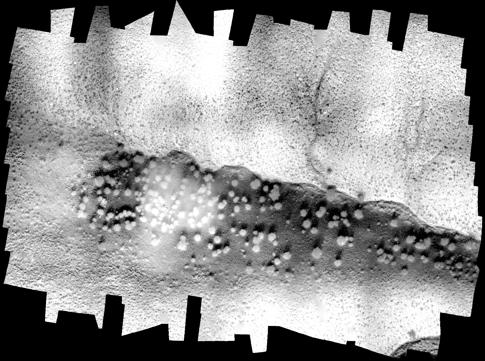
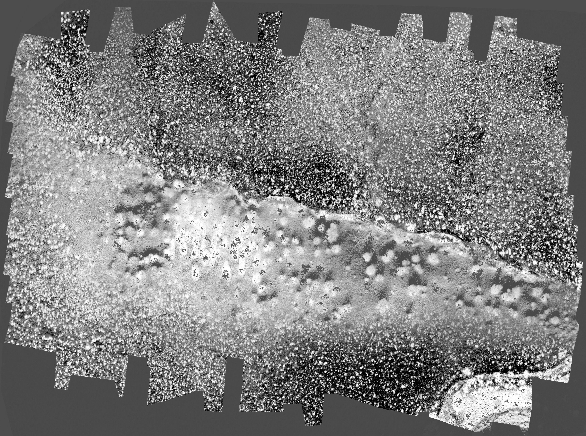
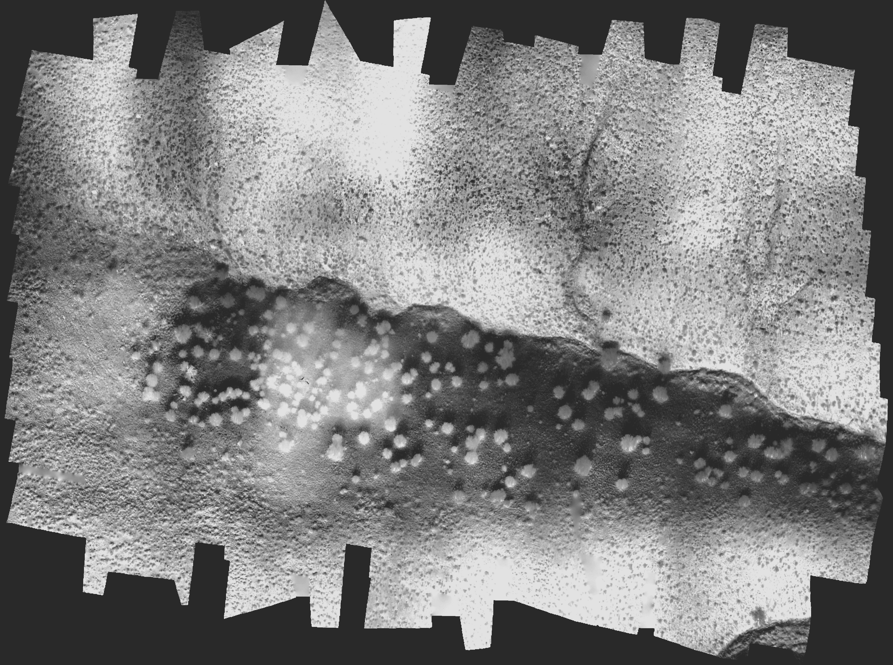
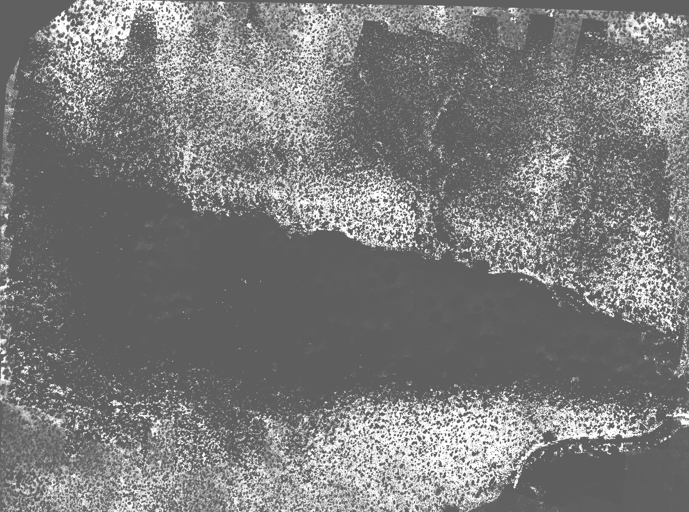

# SEBAL_Drone_PROCESS
Processes drone images using the SEBAL algorithm to calculate soil saturation.

## Inputs
Takes two input images (and can be configred differently):
1. RGB Image (where the red, green, and blue channels correspond to the red, green, and blue bands respectively captured by the drone).
1. Composite Image (where the red, green, and blue channels correspond to the red, thermal, and near-infared bands respectively captured by the drone).

### Sample Inputs
#### RGB Image:

#### Composite Image:

### Sample Outputs
Name | Image
---- | -----
Net Radiation (Rn) | 
Thermal Image (extracted) | 
Soil Flux (G) | 
Sensible Heat Flux (H) | 
Soil Saturation (S) | 
